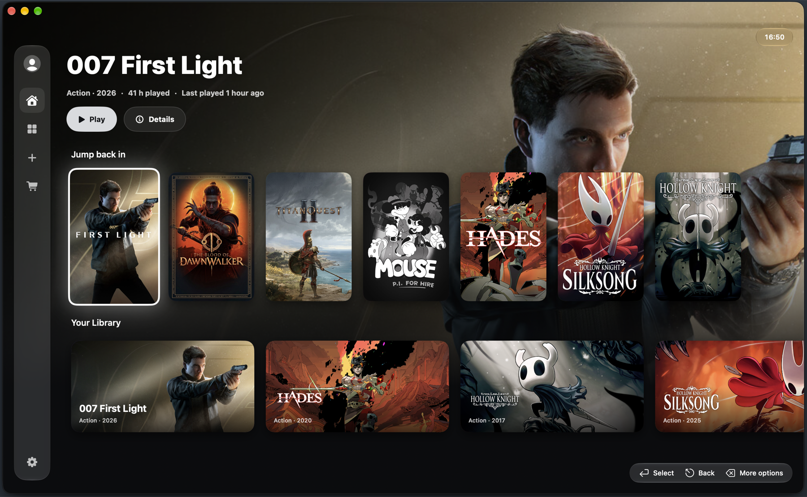

<h1> GameTransit</h1>

**Play your Windows games on Apple Silicon — from the couch or the desk.**

---

GameTransit is a free, console-style launcher for the Windows games you own. Add a game or sign in to Steam, the
Epic Games Store or GOG, and GameTransit finds its artwork, sets up a Windows environment for it and runs it through Apple's Game
Porting Toolkit or WineForge — with a controller, a keyboard or a mouse.

  

Screenshot of a demo library. Game names, artwork and descriptions were fetched live from the Steam Store by GameTransit. All game content © its respective publishers. No games are included with GameTransit.

## Features

| Feature | Notes |
|---|---|
| **_Console-style library_** | Hero artwork, a "Jump back in" row, search, light and dark appearance |
| **_Controllers everywhere_** | Xbox, PlayStation and MFi controllers work in every screen and in games, keyboard and mouse too |
| **_Add games your way_** | By file, folder or drag and drop, installers and redistributables are skipped automatically, a game can also start from its own `.bat` or `.cmd` script |
| **_Automatic game info_** | Artwork and details from Steam (no account needed), SteamGridDB as an optional fallback |
| **_Covers your way_** | Pick your own cover for any game, or choose where its artwork comes from |
| **_Steam_** | Valve's Windows Steam client in its own Windows environment, games you install there appear in your library |
| **_Epic Games Store_** | Epic's Windows launcher in its own Windows environment, games you install there appear in your library |
| **_GOG_** | GOG Galaxy in its own Windows environment, games you install there appear in your library |
| **_Offline start_** | Steam games whose anti-cheat launcher can't run on a Mac can start offline, single-player only |
| **_Engine per game_** | Apple's Game Porting Toolkit, WineForge or WineForge Video, and D3DMetal 4 or 3, chosen per game |
| **_In-game videos_** | WineForge Video plays in-game videos that don't play on normal WineForge, as an engine choice or a switch for store games |
| **_GPU per game_** | Choose the graphics card a game sees (Intel Arc, NVIDIA RTX 4080 or RTX 5080), for games that crash on the default one |
| **_Windows components_** | Microsoft's Visual C++ runtime and .NET Framework 4.8 per game, installed from Microsoft before the first launch |
| **_DLSS → MetalFX_** | Games that offer NVIDIA DLSS can get Apple's MetalFX upscaling instead, where D3DMetal supports it |
| **_Display per game_** | Retina (full resolution) and Apple's Metal performance HUD, per game or for all games, the HUD's look, size and corner in Settings, Shift+F9 shows or hides it while playing |
| **_Save backups_** | Saves are copied after every session and restored in one step |
| **_Game tools_** | Run a game's own installers, add a trainer for single-player games, read the last session's log |
| **_Updates_** | GameTransit tells you when a new version is out, WineForge updates from its official releases, checksum-verified, with one-step rollback |
| **_Dock_** | Recent games from the Dock, and any game as its own Dock shortcut |
| **_Tidy storage_** | Cleans up Windows environments and shader caches left over from removed games, and lists each one before deleting |
| **_Your language_** | English and 37 more languages, following your Mac or picked in Settings |

## Engines

| Engine | Used for | Graphics |
|---|---|---|
| **_Game Porting Toolkit_** | Games you add, by default | Apple's Wine 7.7 with D3DMetal 3 |
| **_WineForge_** | Steam, Epic Games, GOG Galaxy, and games that need newer Windows features | Wine 11 with D3DMetal 4 (or 3, per game) |
| **_WineForge Video_** | Games whose in-game videos don't play, chosen per game | WineForge with video modules included in the app |

GameTransit downloads Wine and WineForge from their official releases and checks them before installing.
D3DMetal is Apple software that apps may not ship, so you download the Game Porting Toolkit from Apple with your
own Apple ID and GameTransit imports it unmodified.

## Requirements

- Apple Silicon Mac (M1 or later), macOS 27 or later
- Rosetta 2 (GameTransit can install it)
- About 2 GB of free space for the engines, plus your games
- For DirectX 12 games: Apple's Game Porting Toolkit 3 (and optionally 4), downloaded with your Apple ID

## Installing

1. Download the GameTransit `.dmg` from the [latest release](../../releases/latest), open it and drag GameTransit into
   **Applications**.
2. Open GameTransit. The first time, macOS says it can't verify the developer: GameTransit is free and isn't
   notarized by Apple (that needs a paid Apple developer membership). Choose **Done** (not the button that deletes it).
3. Open **System Settings → Privacy & Security**, scroll to **Security** and click **Open Anyway** next to the
   GameTransit message, then confirm with your password.
4. GameTransit opens. macOS remembers the choice, so this is only needed once per version.

## Updating

Download the new release's `.dmg` and drag GameTransit into **Applications** again, replacing the old copy. Your games, settings and saves stay where they are. Then confirm **Open Anyway** once more, as above.

## Getting started

1. Install GameTransit (see [Installing](#installing)).
2. Follow the welcome tour: it installs Rosetta 2 and the game engine and imports D3DMetal.
3. Add a game, or install Steam, the Epic Games Launcher or GOG Galaxy from Settings and sign in.
4. Play. Each game's details have its engine, display and tools settings.

## Where files go

Everything lives in `~/Library/Application Support/GameTransit/`: `library.json`, `Engines/` (the Game Porting
Toolkit's Wine, WineForge and D3DMetal), `Bottles/` (one Windows environment per game, with its saves and a
`last-run.log`) and `Save Backups/`. D3DMetal keeps its shader caches in macOS's own cache folder, and Settings →
Storage shows and clears them. Nothing is added to your `PATH`, `~/.wine` or system folders. To uninstall, clear the
shader caches in Settings → Storage, then delete the app and that folder.

## Privacy

GameTransit has no accounts, ads, analytics or tracking. It doesn't collect or send anything about you, your Mac or
your games. It only goes online for what you see it do:

- **Artwork and game details:** the Steam store and SteamGridDB, asked with the game's title or Steam app ID.
- **Updates and engines:** GitHub, to check for a new GameTransit release and to download WineForge and the Game
  Porting Toolkit's Wine.
- **Installers you start:** Steam, the Epic Games Launcher and GOG Galaxy from their own servers, and Microsoft's
  Visual C++ and .NET installers when a game needs them. Microsoft's installers and the engines are checked against
  pinned checksums.
- **Store clients:** Steam, Epic and GOG Galaxy run as they do on Windows and talk to their own services when you sign
  in. Your sign-in goes to them, never to GameTransit.

Everything else stays on your Mac: your library, settings, saves, backups and logs. Games you add yourself have no
internet unless you allow it in their settings.

## Game requests and bug reports

Use [Issues](../../issues/new/choose) and pick a form:

- **Game compatibility request:** a game you own doesn't start, crashes or runs badly. Include the settings you
  tried and the game's last session log (game → Details → Show Last Session Log).
- **Compatibility report:** a game runs well (or partly). Share the settings that work, how it runs and, if you
  like, a link to a gameplay video. Reports help other players pick the right settings.
- **Bug report:** something in GameTransit itself doesn't work.

Your GameTransit version is shown in Settings → Credits.

A game can only be fixed once it can be tested. If you'd like a game looked at and it isn't in the test library
yet, you can contribute towards a copy on [Ko-fi](https://ko-fi.com/nikiizvorski), with the game's name and the
issue number in your message.

## Content policy

GameTransit is for games you own. It does not endorse, support or help with pirated software in any way, and it
contains nothing that bypasses DRM, store checks or license checks. Games from Steam, the Epic Games Store and GOG
run through the stores' own clients with your own account. The per-game compatibility options are for single-player and
offline play. Don't use them with online games that use anti-cheat.

## Support

GameTransit is free and always will be. If it saves you time and you'd like to support the work, or help buy games
for compatibility testing:

- **Ko-fi:** [ko-fi.com/nikiizvorski](https://ko-fi.com/nikiizvorski)
- **Crypto (Ethereum & EVM networks: ETH, USDC):** `0xAc10Ee3F8399EBecfd770B4dA6e5Fe77A73B9b1d`

The same links are in the app under Settings → Support.

## License

GameTransit is free to download and use. It may only be shared by linking to this page or its releases, and copies
may not be modified, repackaged or sold. See [LICENSE](LICENSE) for the full terms. The projects GameTransit
downloads or works with keep their own licenses, see [Credits & acknowledgments](#credits--acknowledgments) and
[THIRD_PARTY_NOTICES.md](THIRD_PARTY_NOTICES.md).

## Credits & acknowledgments

GameTransit stands on the work of these projects and people:

- [Wine](https://gitlab.winehq.org/wine/wine) by the WineHQ contributors — the Windows compatibility layer everything
  here runs on. GNU LGPL 2.1 or later.
- [Game Porting Toolkit](https://developer.apple.com/games/game-porting-toolkit/) by Apple — D3DMetal, which turns
  DirectX 11 and 12 into Metal, and the MetalFX upscaling behind DLSS → MetalFX. Apple's license, **not
  distributed with GameTransit**.
- [Game Porting Toolkit Wine](https://github.com/Gcenx/game-porting-toolkit) — Apple's open-source Wine, packaged by
  [Gcenx](https://github.com/Gcenx). GNU LGPL 2.1.
- [CrossOver](https://www.codeweavers.com/crossover) by CodeWeavers — whose Wine work the Game Porting Toolkit's
  Wine is built on.
- [WineForge](https://github.com/Alien4042x/WineForge) by Alien4042x — Wine 11 with D3DMetal support, used for store
  clients and chosen games. GNU LGPL 2.1 or later. The full engine is downloaded from its official releases.
  GameTransit bundles rebuilt `mfplat` and `winegstreamer` modules for the optional WineForge Video mode.
- [winevideo](https://github.com/Jfishin/winevideo) by Jfishin and its contributors — the Media Foundation video
  patches adapted to WineForge for WineForge Video. These modified Wine modules retain Wine's GNU LGPL 2.1 or
  later license. See [THIRD_PARTY_NOTICES.md](THIRD_PARTY_NOTICES.md) for attribution and corresponding source.
- [Proton](https://github.com/ValveSoftware/Proton) by Valve and its contributors — the upstream VP9/AV1 work
  ported through winevideo into the bundled video modules.
- [DXMT](https://github.com/3Shain/dxmt) by 3Shain — a Metal-based DirectX 11 layer shipped with WineForge, its DLSS
  setup was a reference for GameTransit's.
- [llvm-mingw](https://github.com/mstorsjo/llvm-mingw) by Martin Storsjö — the toolchain that builds GameTransit's
  Windows helpers, which include parts of the MinGW-w64 runtime (notices in
  [THIRD_PARTY_NOTICES.md](THIRD_PARTY_NOTICES.md)).
- [Steam](https://store.steampowered.com) by Valve — the Windows Steam client, downloaded from Valve's servers and
  **not distributed with GameTransit**, game details come from the Steam Store.
- [Epic Games Launcher](https://store.epicgames.com) by Epic Games — downloaded from Epic's servers and **not
  distributed with GameTransit**.
- [GOG Galaxy](https://www.gog.com/galaxy) by GOG — downloaded from GOG's servers and **not distributed with
  GameTransit**.
- [Microsoft .NET Framework](https://dotnet.microsoft.com/download/dotnet-framework) — installed from Microsoft's own
  download for the Epic Games Launcher and for games that need it.
- [SteamGridDB](https://www.steamgriddb.com) — community artwork for games that aren't on Steam.
- [Microsoft Visual C++ Redistributable](https://learn.microsoft.com/cpp/windows/latest-supported-vc-redist) —
  installed from Microsoft's own download when a game needs it.
- [Whisky](https://github.com/Whisky-App/Whisky) and [MetalSharp](https://github.com/metalsharp/MetalSharp) —
  inspiration and ideas for running Windows games and Steam on macOS.

Game data and artwork belong to their owners. GameTransit is not affiliated with Apple, Valve, Epic Games, GOG,
Microsoft, CodeWeavers, SteamGridDB or any of the projects above.
